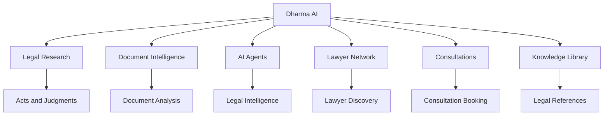
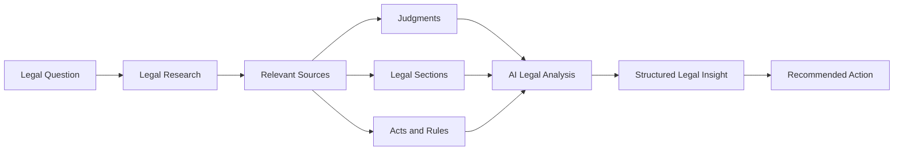
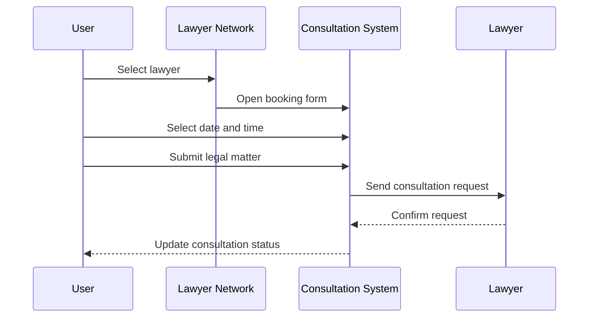

# ⚖️ Dharma AI

### Legal Intelligence Workspace for Modern Legal Research

Dharma AI is a premium legal intelligence workspace designed to bring **legal research, AI-assisted analysis, document intelligence, legal drafting, knowledge management, lawyer discovery, and consultation management** into one unified platform.

The goal is simple:

> **Research → Analyze → Draft → Verify → Consult → Act**

---

## ✨ Overview

Dharma AI combines legal workflows that are normally spread across multiple tools into one organized workspace.

### Core Capabilities

- 🔎 Legal Research
- 🤖 AI Legal Agents
- 📄 Document Intelligence
- ⚖️ Constitutional Analysis
- 🛡️ Compliance Analysis
- ✍️ AI-assisted Legal Drafting
- 📚 Legal Knowledge Library
- 👨‍⚖️ Lawyer Network
- 📅 Consultation Management
- 🧠 Legal Insights
- 🕸️ Knowledge Graph
- 🔖 Research Bookmarks
- 📊 Matter Intelligence
- 🔔 Notifications
- 🌗 Dark / Light Theme
- ⌘ Command Palette

---

# 🧩 Product Architecture



---

# 🧠 Legal Intelligence Workflow

A typical legal research workflow starts with a question and progressively builds context from legal sources.



---

# 🔎 Legal Research

Dharma AI provides a dedicated research workspace for exploring legal material.

### Research Capabilities

- Search laws and sections
- Explore judgments
- Identify relevant legal provisions
- Review landmark cases
- Cross-reference legal material
- Generate AI-assisted analysis
- Bookmark useful results
- Export research results
- Identify applicable legal provisions

### Research Workflow

```text
Search
   ↓
Relevant Legal Sources
   ↓
Sections + Acts + Judgments
   ↓
Cross References
   ↓
AI Analysis
   ↓
Recommended Actions
```

---

# 🤖 AI Legal Agents

Dharma AI is designed around specialized legal agents instead of a single generic chatbot.

## 🔎 Research Agent

Designed to help identify:

- Relevant laws
- Legal sections
- Judicial precedents
- Related judgments
- Supporting authorities

## ✍️ Drafting Agent

Designed for:

- Legal notices
- Applications
- Contracts
- Complaints
- Structured legal documents

## 🛡️ Compliance Agent

Designed to analyze:

- Applicable regulations
- Compliance obligations
- Potential risks
- Recommended actions

## ⚖️ Constitution Agent

Designed to work with:

- Constitutional provisions
- Fundamental Rights
- Constitutional doctrines
- Landmark judgments
- Judicial interpretation

---

# 📄 Document Intelligence

The Document Intelligence workspace is designed to convert large legal documents into structured information.

### Analysis Areas

| Area | Purpose |
|---|---|
| Executive Summary | Understand the document quickly |
| Parties | Identify involved parties |
| Important Dates | Extract key dates and deadlines |
| Applicable Laws | Identify relevant provisions |
| Legal Risks | Highlight potential issues |
| Recommendations | Suggest possible next actions |

### Document Workflow

```text
Upload Document
      ↓
Document Processing
      ↓
Information Extraction
      ↓
Legal Analysis
      ↓
Risk Identification
      ↓
Recommendations
```

---

# ⚖️ Legal Insights

The Insights workspace provides structured AI-assisted legal analysis.

A typical insight can contain:

- Relevant sections
- Key judgments
- Applicable laws
- Legal reasoning
- Confidence indicators
- Suggested actions
- Related research material

### Example Actions

- Draft complaint
- Check limitation period
- Export as brief
- Review applicable law
- Explore related judgments

---

# 📚 Knowledge Library

The Knowledge Library acts as a centralized legal reference area.

### Reference Categories

- Constitution of India
- Bharatiya Nyaya Sanhita, 2023
- Bharatiya Nagarik Suraksha Sanhita, 2023
- Bharatiya Sakshya Adhiniyam, 2023
- Central Acts
- State Acts
- Landmark Judgments
- Circulars
- Notifications

Users can also save important research results as bookmarks for future reference.
# 👨‍⚖️ Lawyer Network

The Lawyer Network allows users to discover legal professionals using multiple criteria.

### Search & Filtering

- Specialisation
- Location
- Experience
- Rating
- Availability

### Supported Practice Areas

- Criminal Law
- Civil Law
- Corporate Law
- Family Law
- Property Law
- Tax Law
- Intellectual Property
- Labour Law
- Cyber Law
- Constitutional Law
- Arbitration
- Banking & Finance
- Corporate Compliance

### Lawyer Profiles

Each profile can display:

- Profile image
- Lawyer name
- Verification status
- Specialisation
- Rating
- Reviews
- Location
- Years of experience
- Availability
- Consultation options

---

# 📅 Consultation Management

Users can request consultations directly through the Lawyer Network.

### Consultation Workflow



### Consultation States

| Status | Meaning |
|---|---|
| Pending | Waiting for lawyer confirmation |
| Confirmed | Lawyer accepted |
| Upcoming | Session is scheduled |
| Completed | Consultation finished |
| Cancelled | Consultation was cancelled |

---

# 🏛️ Workspace

The main workspace provides a centralized view of active legal matters.

### Workspace Modules

- Overview
- Matters
- Research
- Documents
- Judgments
- AI Agents
- Insights
- Knowledge Graph
- Templates
- Consultations
- Lawyer Network
- Knowledge Library

### Matter Intelligence

Each matter can be connected with:

- Case information
- Documents
- Legal research
- Deadlines
- Hearings
- AI insights
- Recommended actions

---

# 🔖 Research Bookmarks

Important legal research results can be saved for future reference.

```text
Research Result
      ↓
Review
      ↓
Bookmark
      ↓
Saved Research
      ↓
Revisit Later
```

Bookmarks help users create a personalized legal research collection.

---

# 🔔 Notifications

The notification system provides a centralized place for important workspace events.

Possible notification categories include:

- Consultation updates
- Research updates
- Matter activity
- Document activity
- AI analysis completion
- System notifications

---

# 🎨 Design System

Dharma AI uses a premium legal-tech interface designed around clarity and professional usability.

## 🌑 Dark Theme

- Deep Navy backgrounds
- Midnight Blue surfaces
- Warm Ivory typography
- Champagne accents
- Subtle borders
- Minimal visual noise

## ☀️ Light Theme

The light theme uses the selected:

### Ocean Blue + Champagne

- Ocean Blue background
- Soft blue-white surfaces
- Deep Navy typography
- Champagne Gold accents
- Clean content cards
- High readability

---

# 📱 Responsive Design

Dharma AI is designed to adapt across:

- 🖥️ Desktop
- 💻 Laptop
- 📱 Tablet
- 📲 Mobile

Responsive behavior includes:

- Collapsible sidebar navigation
- Flexible dashboard grids
- Responsive cards
- Mobile-friendly forms
- Adaptive search controls
- Touch-friendly controls
- Responsive consultation interfaces
- Mobile-optimized layouts

---

# 🛠️ Technology

The current Dharma AI prototype is implemented as a lightweight browser-based application.

### Core Technologies

- HTML5
- CSS3
- JavaScript
- Responsive Web Design
- Browser APIs
- Client-side application logic

### Interface

- Custom design system
- Responsive layouts
- Interactive components
- Modal workflows
- Dynamic navigation
- Theme switching
- Dashboard components

---

# 📁 Project Structure

```text
Dharma-AI/
│
├── index.html
│
└── README.md
```

The current prototype intentionally keeps the application lightweight and self-contained.

---

# 💻 Run Locally

Clone the repository:

```bash
git clone https://github.com/srivastavanaavya75-lgtm/Dharma-AI.git
```

Navigate into the project:

```bash
cd Dharma-AI
```

Open the project in Visual Studio Code.

For the easiest development experience, use the **Live Server** extension and open `index.html`.

---

# 🌐 Deployment

Dharma AI can be deployed using:

- GitHub Pages
- Netlify
- Vercel
- Cloudflare Pages

### Deployment Flow

```text
GitHub Repository
       ↓
Static Hosting
       ↓
CDN
       ↓
Dharma AI
       ↓
User Browser
```

---

# 🔐 Responsible Legal AI

Dharma AI is designed as an AI-assisted legal intelligence and research platform.

It is **not a replacement for qualified legal professionals**.

AI-generated information should be:

1. Reviewed by a qualified professional.
2. Verified against authoritative legal sources.
3. Checked for jurisdictional applicability.
4. Evaluated against the specific facts of the matter.

---

# ⚠️ Legal Disclaimer

Dharma AI is intended for:

- Educational purposes
- Legal research assistance
- Demonstration
- Information discovery
- Workflow experimentation
- AI product development research

It does **not** create an attorney-client relationship or guarantee the accuracy of AI-generated information.

Users should independently verify legal information before relying on it for a legal matter.

---

# 📊 Project Status

## Dharma AI v4.4

| Module | Status |
|---|:---:|
| Premium Dashboard | ✅ |
| Overview | ✅ |
| Matters | ✅ |
| Legal Research | ✅ |
| Research Filters | ✅ |
| AI Agents | ✅ |
| Legal Insights | ✅ |
| Document Intelligence | ✅ |
| Document Export | ✅ |
| Judgments | ✅ |
| Knowledge Library | ✅ |
| Bookmarks | ✅ |
| Lawyer Network | ✅ |
| Lawyer Profiles | ✅ |
| Consultation Booking | ✅ |
| Consultation Tracking | ✅ |
| Notifications | ✅ |
| Command Palette | ✅ |
| Dark Theme | ✅ |
| Light Theme | ✅ |
| Ocean Blue Theme | ✅ |
| Responsive Interface | ✅ |

---

# 🚀 Roadmap

### Phase 1 — Platform Infrastructure

- [ ] Backend API
- [ ] Authentication
- [ ] User accounts
- [ ] Role-based access
- [ ] Secure database
- [ ] Cloud document storage

### Phase 2 — Legal Intelligence

- [ ] Real legal database integration
- [ ] Retrieval-Augmented Generation
- [ ] Semantic legal search
- [ ] Citation-grounded AI
- [ ] Advanced case comparison
- [ ] Legal document embeddings

### Phase 3 — Professional Workflows

- [ ] Real lawyer verification
- [ ] Real-time consultation scheduling
- [ ] Secure lawyer-client messaging
- [ ] Document collaboration
- [ ] Case management
- [ ] Advanced matter analytics

### Phase 4 — Intelligent Platform

- [ ] Multi-agent orchestration
- [ ] Real-time legal updates
- [ ] Personalized legal workspace
- [ ] Intelligent legal alerts
- [ ] Advanced knowledge graph
- [ ] Mobile application

---

# 🎯 Product Vision

Dharma AI aims to evolve from a legal intelligence prototype into a complete legal technology ecosystem.

```text
Discover
   ↓
Research
   ↓
Understand
   ↓
Analyze
   ↓
Draft
   ↓
Verify
   ↓
Consult
   ↓
Act
```

The long-term vision is to make legal work more organized, contextual, and accessible while keeping qualified human professionals at the center of important legal decisions.

---

# 🏆 Why Dharma AI?

Dharma AI is designed as more than a generic chatbot.

Traditional workflow:

```text
Question
   ↓
Search Engine
   ↓
Legal Database
   ↓
Document Tool
   ↓
Case Research
   ↓
Lawyer Directory
   ↓
Calendar
```

Dharma AI brings these workflows into one workspace:

```text
Legal Question
      ↓
Research
      ↓
Legal Sources
      ↓
AI Analysis
      ↓
Document Intelligence
      ↓
Risk Assessment
      ↓
Recommended Action
      ↓
Lawyer Discovery
      ↓
Consultation
```

This makes the platform focused on:

- Context
- Organization
- Traceability
- Actionability
- Human verification

---

# 👩‍💻 Author

## Naavya Srivastava

**B.Tech CSE (Data Science)**

### Areas of Interest

- Artificial Intelligence
- Data Science
- Machine Learning
- Legal Technology
- AI Product Development
- Full-Stack Development
- Human-Centered AI

---

# ⭐ Support

If you find Dharma AI interesting, consider giving the repository a ⭐ on GitHub.

---

# 📜 License

This project is currently intended for educational, research, demonstration, and portfolio purposes.

---

<div align="center">

## ⚖️ Dharma AI

### Research smarter. Analyze deeper. Practice better.

**Built with AI, code, and a vision for better legal technology.**

</div>
