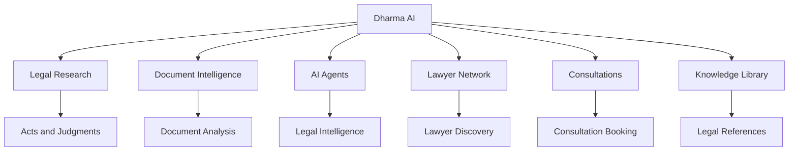
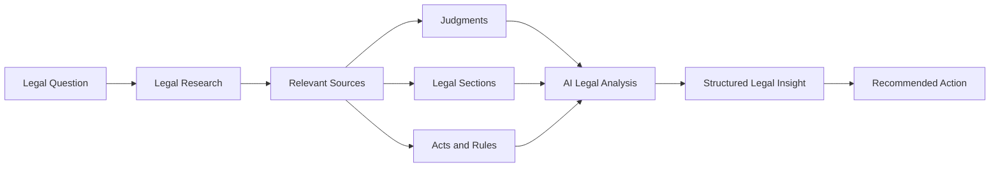

# ⚖️ Dharma AI

### Legal Intelligence Workspace for Modern Legal Research

Dharma AI is a premium legal intelligence workspace designed to bring **legal research, AI-assisted analysis, document intelligence, legal drafting, knowledge management, lawyer discovery, and consultation management** into one unified platform.

The goal is simple:

> **Research → Analyze → Draft → Verify → Consult → Act**

---

## ✨ Overview

Dharma AI combines legal workflows that are normally spread across multiple tools into one organized workspace.

### Core Capabilities

- 🔎 Legal Research
- 🤖 AI Legal Agents
- 📄 Document Intelligence
- ⚖️ Constitutional Analysis
- 🛡️ Compliance Analysis
- ✍️ AI-assisted Legal Drafting
- 📚 Legal Knowledge Library
- 👨‍⚖️ Lawyer Network
- 📅 Consultation Management
- 🧠 Legal Insights
- 🕸️ Knowledge Graph
- 🔖 Research Bookmarks
- 📊 Matter Intelligence
- 🔔 Notifications
- 🌗 Dark / Light Theme
- ⌘ Command Palette

---

# 🧩 Product Architecture



---

# 🧠 Legal Intelligence Workflow

A typical legal research workflow starts with a question and progressively builds context from legal sources.



---

# 🔎 Legal Research

Dharma AI provides a dedicated research workspace for exploring legal material.

### Research Capabilities

- Search laws and sections
- Explore judgments
- Identify relevant legal provisions
- Review landmark cases
- Cross-reference legal material
- Generate AI-assisted analysis
- Bookmark useful results
- Export research results
- Identify applicable legal provisions

### Research Workflow

```text
Search
   ↓
Relevant Legal Sources
   ↓
Sections + Acts + Judgments
   ↓
Cross References
   ↓
AI Analysis
   ↓
Recommended Actions
```

---

# 🤖 AI Legal Agents

Dharma AI is designed around specialized legal agents instead of a single generic chatbot.

## 🔎 Research Agent

Designed to help identify:

- Relevant laws
- Legal sections
- Judicial precedents
- Related judgments
- Supporting authorities

## ✍️ Drafting Agent

Designed for:

- Legal notices
- Applications
- Contracts
- Complaints
- Structured legal documents

## 🛡️ Compliance Agent

Designed to analyze:

- Applicable regulations
- Compliance obligations
- Potential risks
- Recommended actions

## ⚖️ Constitution Agent

Designed to work with:

- Constitutional provisions
- Fundamental Rights
- Constitutional doctrines
- Landmark judgments
- Judicial interpretation

---

# 📄 Document Intelligence

The Document Intelligence workspace is designed to convert large legal documents into structured information.

### Analysis Areas

| Area | Purpose |
|---|---|
| Executive Summary | Understand the document quickly |
| Parties | Identify involved parties |
| Important Dates | Extract key dates and deadlines |
| Applicable Laws | Identify relevant provisions |
| Legal Risks | Highlight potential issues |
| Recommendations | Suggest possible next actions |

### Document Workflow

```text
Upload Document
      ↓
Document Processing
      ↓
Information Extraction
      ↓
Legal Analysis
      ↓
Risk Identification
      ↓
Recommendations
```

---

# ⚖️ Legal Insights

The Insights workspace provides structured AI-assisted legal analysis.

A typical insight can contain:

- Relevant sections
- Key judgments
- Applicable laws
- Legal reasoning
- Confidence indicators
- Suggested actions
- Related research material

### Example Actions

- Draft complaint
- Check limitation period
- Export as brief
- Review applicable law
- Explore related judgments

---

# 📚 Knowledge Library

The Knowledge Library acts as a centralized legal reference area.

### Reference Categories

- Constitution of India
- Bharatiya Nyaya Sanhita, 2023
- Bharatiya Nagarik Suraksha Sanhita, 2023
- Bharatiya Sakshya Adhiniyam, 2023
- Central Acts
- State Acts
- Landmark Judgments
- Circulars
- Notifications

Users can also save important research results as bookmarks for future reference.
# 👨‍⚖️ Lawyer Network

The Lawyer Network allows users to discover legal professionals using multiple criteria.

### Search & Filtering

- Specialisation
- Location
- Experience
- Rating
- Availability

### Supported Practice Areas

- Criminal Law
- Civil Law
- Corporate Law
- Family Law
- Property Law
- Tax Law
- Intellectual Property
- Labour Law
- Cyber Law
- Constitutional Law
- Arbitration
- Banking & Finance
- Corporate Compliance

### Lawyer Profiles

Each profile can display:

- Profile image
- Lawyer name
- Verification status
- Specialisation
- Rating
- Reviews
- Location
- Years of experience
- Availability
- Consultation options

---

# 📅 Consultation Management

Users can request consultations directly through the Lawyer Network.

### Consultation Workflow

```mermaid
sequenceDiagram

    participant User
    participant Network as Lawyer Network
    participant Booking as Consultation System
    participant Lawyer

    User->>Network: Select lawyer
    Network->>Booking: Open booking form
    User->>Booking: Select date and time
    User->>Booking: Submit legal matter
    Booking->>Lawyer: Send consultation request
    Lawyer-->>Booking: Confirm request
    Booking-->>User: Update consultation status
