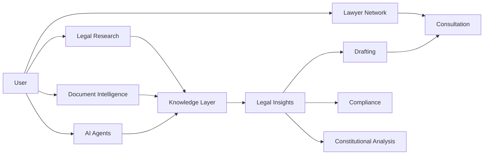
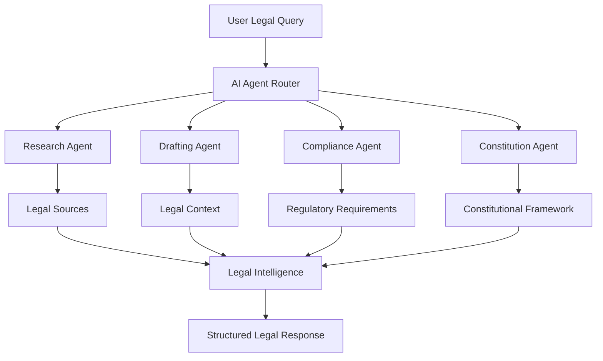
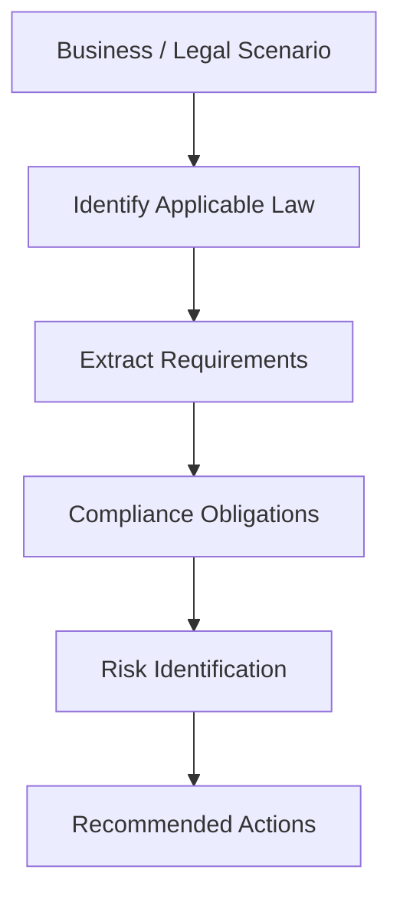
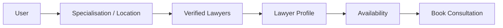
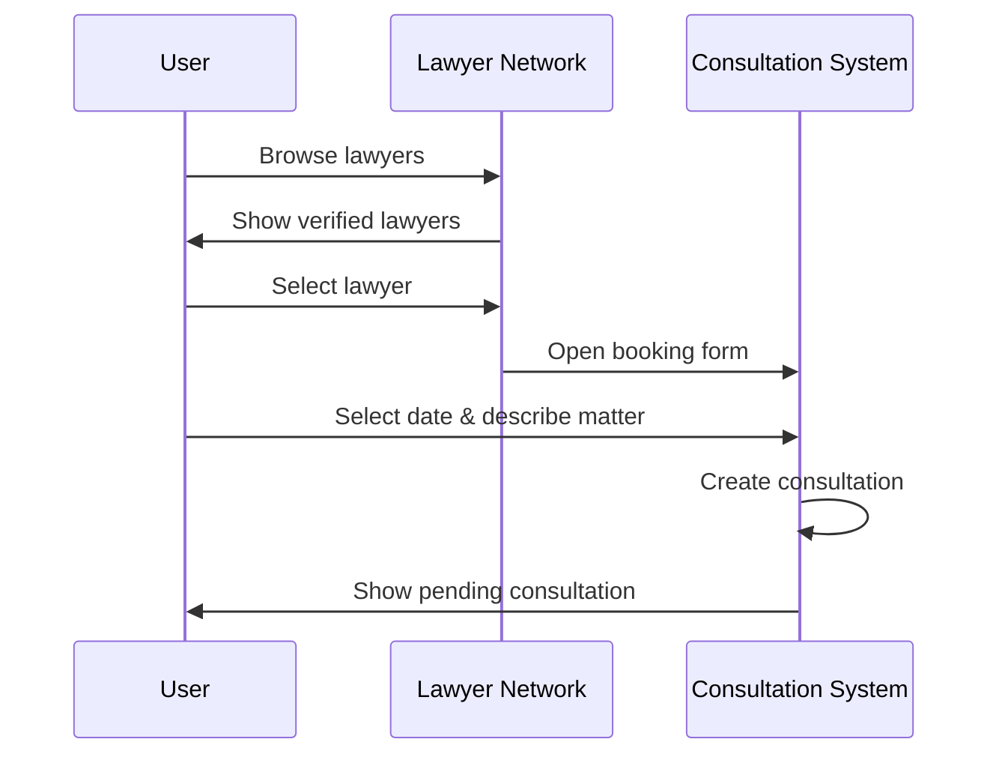
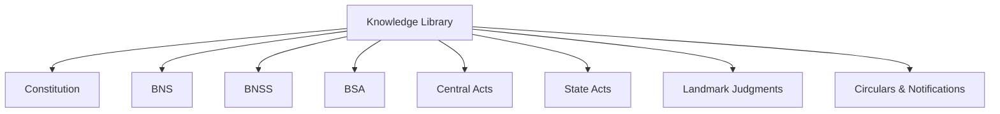
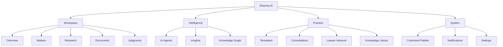
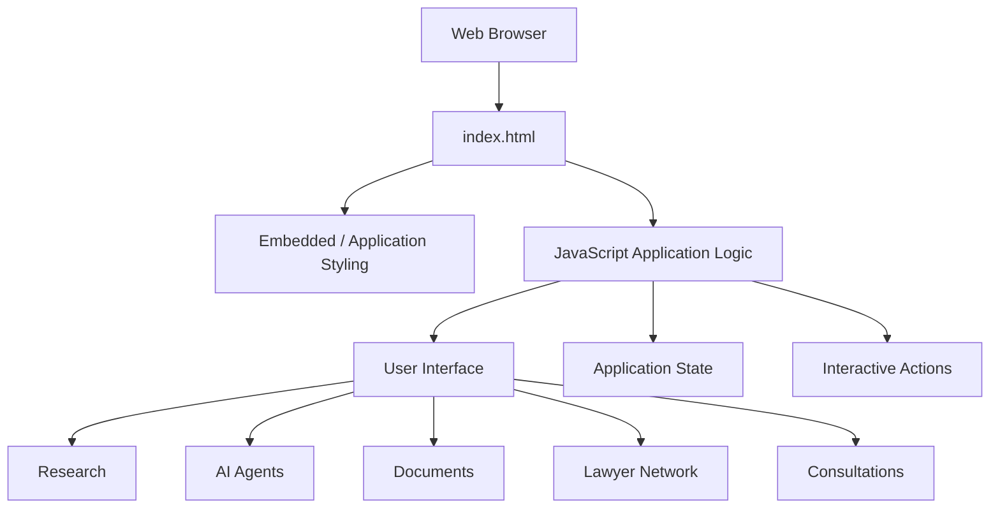
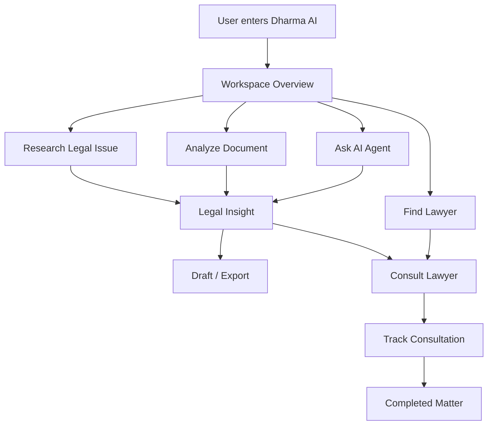
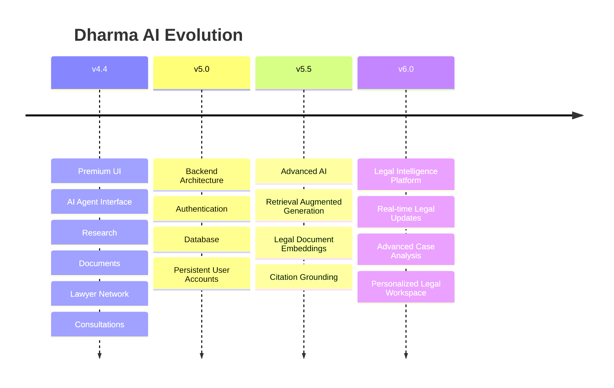

# ⚖️ Dharma AI

### Legal Intelligence Workspace

<p align="center">
  <strong>Research. Analyze. Draft. Consult.</strong>
</p>

<p align="center">
  An AI-powered legal intelligence workspace designed to bring legal research, document intelligence, specialized legal agents, constitutional analysis, and lawyer consultations into one unified platform.
</p>

<p align="center">


</p>

---

## 📌 Overview

**Dharma AI** is a legal technology platform that combines AI-assisted legal workflows with a structured legal workspace.

The platform is designed to help users move through a complete legal workflow:

```text
Research
   ↓
Understand
   ↓
Analyze
   ↓
Draft
   ↓
Verify
   ↓
Consult
```

Instead of switching between multiple tools for legal research, document analysis, drafting, and professional consultation, Dharma AI provides a unified interface.

---

# 🎯 Core Vision

Traditional legal workflows often involve multiple disconnected systems.

```text
Legal Research
      │
      ├──────► Acts
      │
      ├──────► Judgments
      │
      ├──────► Constitutional Provisions
      │
      └──────► Regulations
                     │
                     ▼
              Manual Analysis
                     │
                     ▼
               Document Drafting
                     │
                     ▼
               Lawyer Consultation
```

Dharma AI aims to bring these workflows together:



---

# ✨ Key Features

## 🤖 AI Legal Agents

Dharma AI contains specialized legal intelligence agents designed for different tasks.

| Agent | Purpose |
|---|---|
| 🔎 Research Agent | Research laws, sections, judgments and legal principles |
| ✍️ Drafting Agent | Generate structured legal drafts and notices |
| 🛡️ Compliance Agent | Identify regulations, obligations and legal risks |
| ⚖️ Constitution Agent | Analyze constitutional provisions and doctrines |

### Agent Architecture



---

# 🔎 Legal Research

The Legal Research workspace provides a structured interface for researching:

- Constitution
- Bharatiya Nyaya Sanhita
- Bharatiya Nagarik Suraksha Sanhita
- Bharatiya Sakshya Adhiniyam
- Central Acts
- Rules
- Circulars
- Notifications
- Judgments

### Research Workflow

```mermaid
flowchart LR

    SEARCH[Search Query]
        ↓
    FILTER[Legal Category]
        ↓
    RESULTS[Relevant Results]
        ↓
    CROSS[Cross References]
        ↓
    JUDGMENTS[Relevant Judgments]
        ↓
    AI[Ask AI]
        ↓
    INSIGHT[Legal Insight]
```

Research results can provide:

- Relevant provisions
- Legal descriptions
- Cross references
- Case law
- Ask AI functionality
- Bookmarking
- Citation copying
- Suggested actions

---

# 📄 Document Intelligence

Dharma AI provides a document analysis workflow for extracting structured legal information from uploaded documents.

### Document Analysis Pipeline

```mermaid
flowchart TD

    UPLOAD[Upload Document]
        ↓
    PARSE[Document Processing]
        ↓
    SUMMARY[Executive Summary]
        ↓
    PARTIES[Identify Parties]
        ↓
    TIMELINE[Extract Timeline]
        ↓
    LAWS[Identify Applicable Laws]
        ↓
    RISKS[Detect Legal Risks]
        ↓
    RECOMMEND[Generate Recommendations]
        ↓
    REPORT[Structured Legal Analysis]
```

### Analysis Output

The document intelligence interface can organize information into:

```text
┌─────────────────────────────┐
│ Executive Summary           │
├─────────────────────────────┤
│ Parties                     │
├─────────────────────────────┤
│ Timeline                    │
├─────────────────────────────┤
│ Applicable Laws             │
├─────────────────────────────┤
│ Legal Risks                 │
├─────────────────────────────┤
│ Recommendations             │
└─────────────────────────────┘
```

The system is designed to transform long legal documents into easier-to-review structured information.

---

# ⚖️ Constitution Agent

The Constitution Agent focuses on constitutional questions and legal doctrines.

Example workflow:

```text
Constitutional Question
        ↓
Relevant Article
        ↓
Constitutional Doctrine
        ↓
Landmark Judgments
        ↓
Legal Interpretation
        ↓
Structured Answer
```

Supported concepts include:

- Fundamental Rights
- Constitutional Articles
- Constitutional doctrines
- Rule of law
- Reasonable classification
- Non-arbitrariness
- Landmark judgments

---

# 🛡️ Compliance Intelligence

The Compliance Agent helps analyze regulatory requirements and potential compliance risks.



Typical output structure:

```text
Applicable Regulation
        │
        ├── Requirement
        │
        ├── Obligation
        │
        ├── Potential Risk
        │
        └── Recommended Action
```

---

# 👨‍⚖️ Lawyer Network

Dharma AI includes a lawyer discovery and consultation interface.

Users can browse lawyers using:

- Specialisation
- Location
- Experience
- Rating
- Availability

### Supported Specialisations

```text
Criminal
Civil
Corporate
Family
Property
Tax
IPR
Labour
Cyber Law
Constitutional
```

### Lawyer Discovery Flow



---

# 📅 Consultation Management

The consultation system allows users to manage legal consultation requests.

### Booking Workflow



Consultation states include:

```text
Pending
   │
   ├──────► Confirmed
   │           │
   │           ▼
   │       Upcoming
   │           │
   │           ▼
   │       Completed
   │
   └──────► Cancelled
```

Users can:

- Book consultations
- View consultation details
- Confirm requests
- Reschedule
- Cancel
- Track consultation status

---

# 🧠 Knowledge Library

The Knowledge Library acts as a structured reference interface.

### Included Knowledge Areas

| Category | Content |
|---|---|
| Constitution | Constitution of India |
| Criminal Law | Bharatiya Nyaya Sanhita |
| Procedure | Bharatiya Nagarik Suraksha Sanhita |
| Evidence | Bharatiya Sakshya Adhiniyam |
| Acts | Central Acts |
| State Law | State Acts |
| Case Law | Landmark Judgments |
| Regulatory | Circulars & Notifications |

### Knowledge Architecture



---

# 🔖 Bookmarks

Legal research results can be bookmarked for later reference.

```text
Search Result
     ↓
Bookmark
     ↓
Saved Knowledge
     ↓
Knowledge Library
```

This allows users to build a personalized legal research workspace.

---

# 🏠 Workspace Architecture

The main workspace is organized into several functional areas.



---

# 🖥️ User Interface

Dharma AI uses a premium legal-tech interface designed around:

- Enterprise-style navigation
- Structured information cards
- Legal document panels
- Minimal visual hierarchy
- Champagne accent colors
- Professional typography
- Responsive layout
- Dark and light themes

---

# 🌑 Dark Theme

The original Dharma AI interface uses a deep navy visual language.

```text
Background
     ↓
Deep Navy
     ↓
Dark Blue Panels
     ↓
Warm Ivory Typography
     ↓
Champagne Accents
```

The dark interface is designed for long research sessions while maintaining a professional legal workspace aesthetic.

---

# ☀️ Light Theme

The light theme uses the selected:

### Ocean Blue + Soft Champagne

```text
Ocean Blue
     │
     ├── Navigation
     ├── Text
     └── Accent details
     
Soft Blue / White
     │
     ├── Main surfaces
     ├── Cards
     └── Research panels

Champagne
     │
     ├── Buttons
     ├── Highlights
     └── Premium accents
```

Users can switch between the visual modes from the interface.

---

# 🎨 Design System

### Primary Visual Language

| Element | Direction |
|---|---|
| Dark Background | Deep Navy |
| Light Background | Ocean Blue / Cool White |
| Accent | Champagne |
| Primary Text | Navy / Ivory |
| Borders | Subtle Blue |
| Cards | Elevated panels |
| Buttons | Champagne highlights |

The goal is to maintain a consistent visual identity across the entire application.

---

# 🏗️ Technical Architecture

The current project is intentionally lightweight.



---

# 📂 Project Structure

The current repository is intentionally compact:

```text
Dharma-AI/
│
├── index.html
│
└── README.md
```

The main application currently lives inside `index.html`.

This makes the prototype easy to:

- Run locally
- Inspect
- Modify
- Deploy
- Demonstrate

---

# 💻 Run Locally

Clone the repository:

```bash
git clone https://github.com/srivastavanaavya75-lgtm/Dharma-AI.git
```

Enter the project:

```bash
cd Dharma-AI
```

Then open `index.html`.

### Recommended Development Setup

Use **Visual Studio Code** with the Live Server extension.

The application can then be accessed locally through a browser.

---

# 🌐 Deployment

Dharma AI is suitable for static deployment platforms such as:

- Netlify
- Vercel
- GitHub Pages

### Deployment Architecture

```mermaid
flowchart LR

    CODE[GitHub Repository]
        ↓
    DEPLOY[Static Deployment]
        ↓
    CDN[CDN / Hosting]
        ↓
    USER[Browser]
```

---

# 🔄 Application Workflow

The overall Dharma AI workflow can be represented as:



---

# 📊 Feature Matrix

| Feature | Status |
|---|:---:|
| Workspace Dashboard | ✅ |
| Legal Research | ✅ |
| Research Filters | ✅ |
| AI Research Agent | ✅ |
| Drafting Agent | ✅ |
| Compliance Agent | ✅ |
| Constitution Agent | ✅ |
| Document Analysis | ✅ |
| Document Export | ✅ |
| Knowledge Library | ✅ |
| Landmark Judgments | ✅ |
| Bookmark System | ✅ |
| Lawyer Network | ✅ |
| Lawyer Profiles | ✅ |
| Lawyer Specialisations | ✅ |
| Lawyer Availability | ✅ |
| Consultation Booking | ✅ |
| Consultation Tracking | ✅ |
| Notifications | ✅ |
| Command Palette | ✅ |
| Dark Theme | ✅ |
| Light Theme | ✅ |
| Ocean Blue Theme | ✅ |
| Champagne Accent System | ✅ |

---

# 🔐 Legal & Product Philosophy

Dharma AI is designed around three principles:

### 1. Structured Intelligence

Legal information should be organized into understandable structures rather than presented as an overwhelming block of text.

### 2. Human-in-the-Loop

AI can accelerate legal workflows, but professional judgment remains essential.

### 3. Responsible Legal Technology

AI-generated legal information should be verified against authoritative legal sources before professional reliance.

---

# ⚠️ Legal Disclaimer

Dharma AI is an AI-assisted legal technology project intended for:

- Educational purposes
- Legal research assistance
- Demonstration
- Information discovery
- Workflow experimentation

It does **not** constitute legal advice and does not create an attorney-client relationship.

AI-generated results may contain errors or omissions.

Users should verify legal information against authoritative sources and consult a qualified legal professional before relying on it for a legal matter.

---

# 🗺️ Roadmap

Future versions can evolve Dharma AI from a sophisticated frontend prototype into a complete legal intelligence platform.



### Planned Improvements

- [ ] Backend API
- [ ] Secure authentication
- [ ] Persistent user accounts
- [ ] Cloud document storage
- [ ] Real legal database integration
- [ ] RAG-based legal research
- [ ] Citation-grounded AI responses
- [ ] Advanced document parsing
- [ ] AI case comparison
- [ ] Real-time legal updates
- [ ] Lawyer verification workflow
- [ ] Real consultation scheduling
- [ ] Secure messaging
- [ ] Production database
- [ ] Advanced analytics

---

# 🧪 Project Status

**Current Version: `v4.4`**

Dharma AI is currently a **functional frontend legal intelligence prototype** with interactive workflows covering research, AI agents, documents, lawyer discovery, consultations, bookmarks, themes, and workspace navigation.

The architecture is intentionally lightweight at this stage, allowing rapid iteration before introducing a production backend.

---

# 👩‍💻 Developer

## Naavya Srivastava

**B.Tech CSE (Data Science)**

### Areas of Interest

- Artificial Intelligence
- Data Science
- Machine Learning
- Legal Technology
- AI Product Development
- Full-Stack Development
- Human-Centered AI

---

# ⭐ Project Vision

> **Make legal intelligence easier to research, understand, and act upon.**

Dharma AI is an exploration of how AI can become a practical layer over legal workflows rather than simply another chatbot.

The long-term vision is a unified legal workspace where users can:

```text
Discover
   ↓
Research
   ↓
Understand
   ↓
Analyze
   ↓
Draft
   ↓
Verify
   ↓
Consult
   ↓
Act
```

---

# 📜 License

This project is currently intended for educational, research, demonstration, and portfolio purposes.

---

<p align="center">

### ⚖️ Dharma AI

**Legal Intelligence, reimagined.**

Built with curiosity, code, and a little champagne. 🥂

</p>
